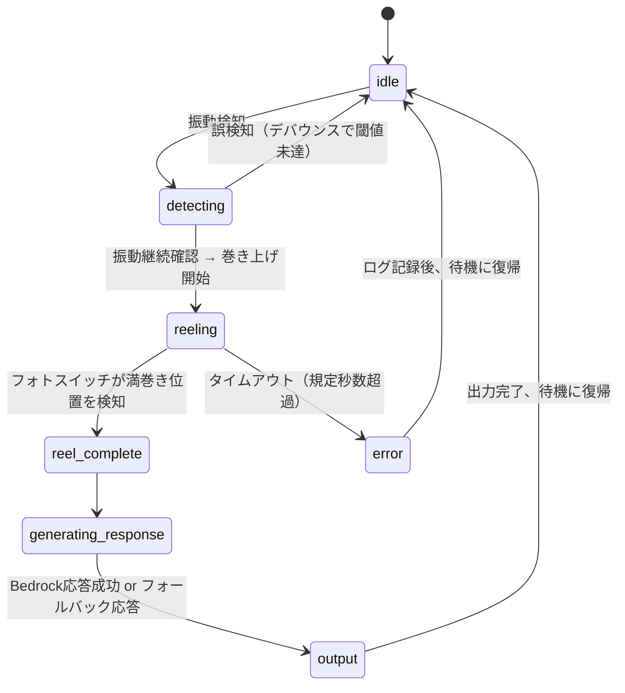

# 状態遷移設計

`device/wakasagi_device/state_machine/machine.py` にて `transitions` ライブラリの
`Machine` クラスを使い、以下の状態・遷移を宣言的に定義する。

## 状態一覧

| 状態 | 説明 |
|---|---|
| `idle` | 待機中。振動センサーを常時監視 |
| `detecting` | 振動を検知し、誤検知でないかデバウンス判定中 |
| `reeling` | モーター駆動中。フォトスイッチで満巻き位置を監視 |
| `reel_complete` | 巻き上げ完了検知。モーター停止済み |
| `generating_response` | Bedrock APIを呼び出しキャラクター応答を生成中 |
| `output` | 応答を出力している状態（現状はテキスト、将来はTTS） |
| `error` | 異常系（タイムアウト等） |

## 状態遷移図

## 異常系の扱い

| 異常 | 検知方法 | 対応 |
|---|---|---|
| 誤検知（風・振動ノイズ） | `detecting` 状態で一定時間・一定回数のサンプリングを行い、閾値を継続的に超えた場合のみ`reeling`へ遷移 | `idle`へ復帰、ログのみ記録 |
| タイムアウト（巻き上げが完了しない） | `reeling`突入から規定秒数以内にフォトスイッチ検知がない | モーター停止、`error`へ遷移 |
| Bedrock API失敗（ネットワーク切断・レート制限等） | `cloud/bedrock/client.py`内での例外捕捉 | リトライ後、固定フォールバックメッセージで`output`へ継続（フローを止めない） |

## スコープ外（将来検討）

- 巻き上げ完了後の仕掛け自動再投入（`releasing`状態）。初期版では`output`後に`idle`へ戻り、
  再投入は手動で行う。
- センサー断線等のセルフテスト。
